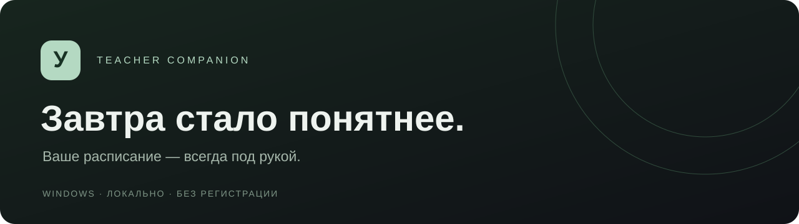
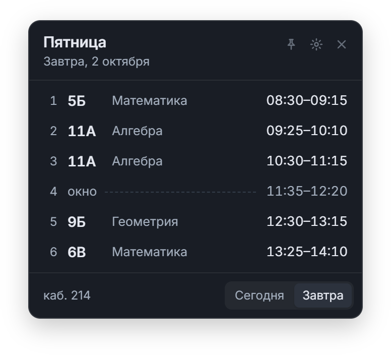
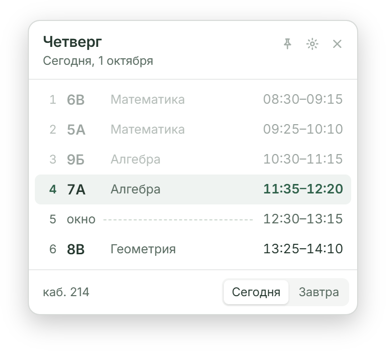
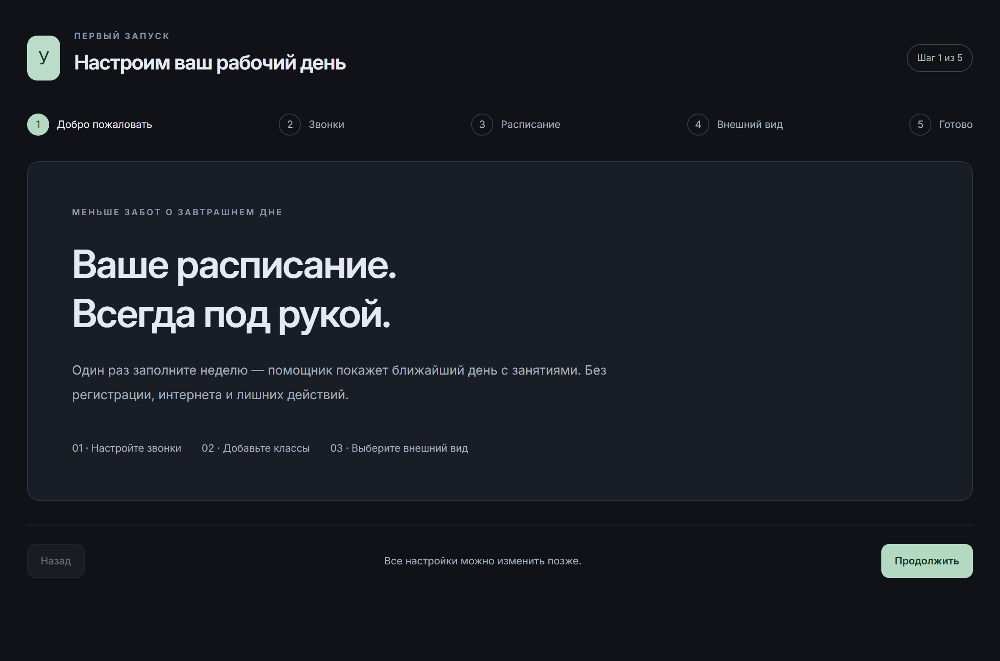
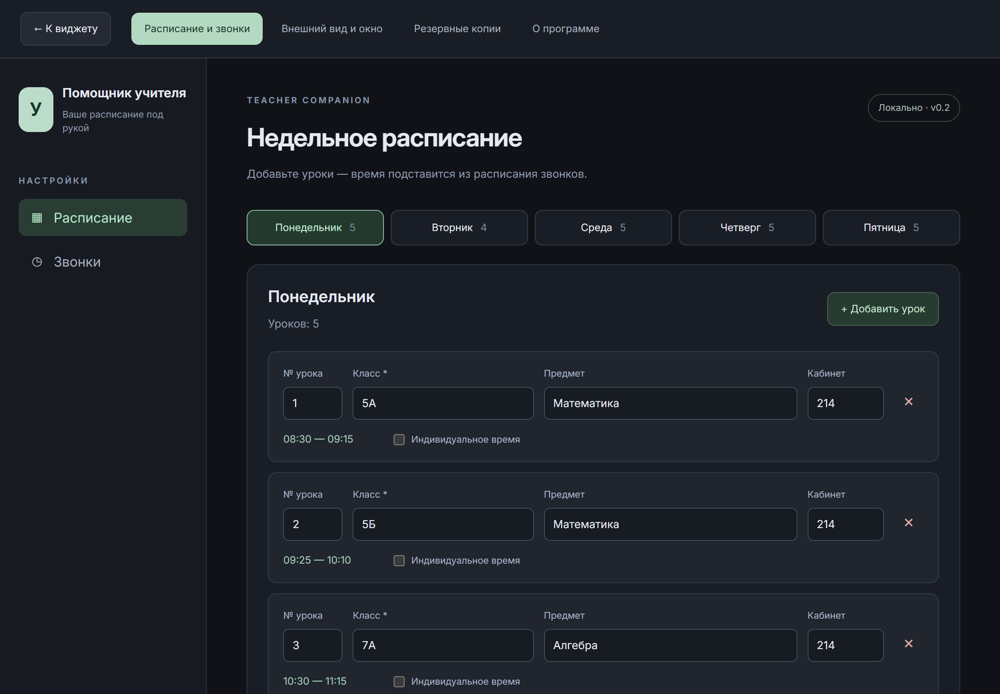
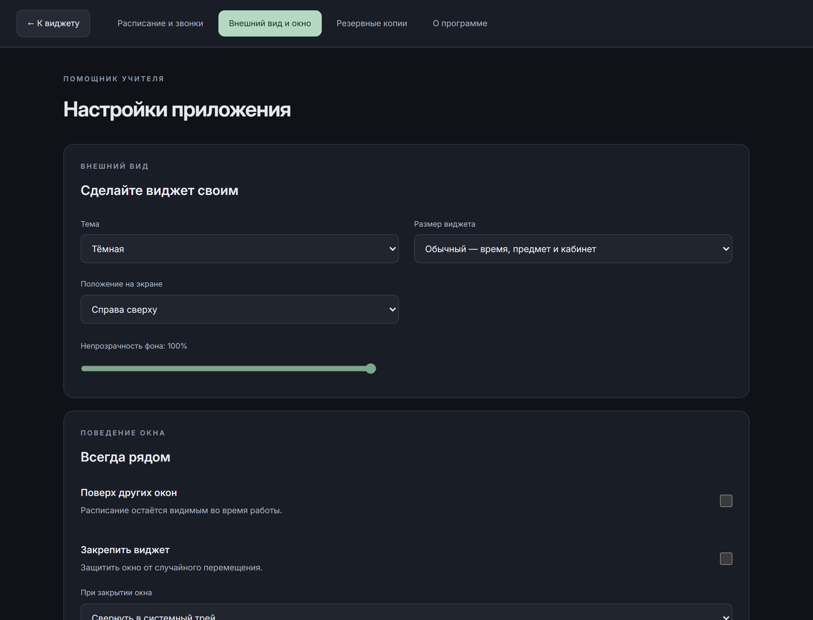

<div align="center">



**Небольшой помощник для больших школьных дней.**

Расписание ближайшего учебного дня прямо на рабочем столе.

[](https://github.com/kuzmin-lemmi/Teacher_Companion/actions/workflows/check.yml)


### [⬇ Скачать для Windows](https://github.com/kuzmin-lemmi/Teacher_Companion/releases/latest/download/TeacherCompanion-Setup.exe)

[Инструкция](docs/GUIDE.md) · [Все версии](https://github.com/kuzmin-lemmi/Teacher_Companion/releases) · [Возможности](#возможности) · [Для разработчиков](#быстрый-старт) · [План развития](docs/ROADMAP.md)

</div>

## Для чего это

Включили компьютер — увидели, какие классы завтра, во сколько начинается первый урок и где есть окно. Не нужно искать фотографию расписания или открывать журнал.

**Teacher Companion / «Помощник учителя»** работает с вашей обычной учебной неделей. Если завтра занятий нет, виджет покажет ближайший день с уроками. Суббота и воскресенье — выходные.

## Интерфейс

<div align="center">

 

_На снимках — демонстрационное расписание, не реальные данные учителя._

</div>

<details>
<summary><strong>Первый запуск, редактор и настройки</strong></summary>







</details>

## Возможности

| Каждый день                              | Под ваш рабочий стол             | Ваши данные                   |
| ---------------------------------------- | -------------------------------- | ----------------------------- |
| Сегодня и следующий учебный день         | Компактный и обычный виджет      | SQLite в Windows              |
| Весь день без прокрутки, текущий урок    | Угол экрана на выбор             | Редакторы уроков и звонков    |
| Номера, классы, время, предмет и кабинет | Светлая, тёмная и системная темы | Без интернета и регистрации   |
| Окна между занятиями                     | Прозрачность фона 80–100%        | Индивидуальное время урока    |
| Смена даты после полуночи                | Закрепление и режим поверх окон  | Проверка пересечений занятий  |
| Обновление при возвращении к приложению  | Трей и автозапуск Windows        | Экспорт и восстановление JSON |

Первый запуск проведёт через звонки, расписание и внешний вид. Можно пропустить заполнение и вернуться к нему позже. Данные сохраняются явно; при уходе из редактора с изменениями приложение спросит, нужно ли остаться.

## Установка

Скачайте [**TeacherCompanion-Setup.exe**](https://github.com/kuzmin-lemmi/Teacher_Companion/releases/latest/download/TeacherCompanion-Setup.exe) со [страницы релизов](https://github.com/kuzmin-lemmi/Teacher_Companion/releases/latest) и запустите. Если Windows покажет «Система Windows защитила ваш компьютер», нажмите «Подробнее» → «Выполнить в любом случае». Права администратора не нужны: приложение ставится в профиль пользователя (`%LOCALAPPDATA%\Teacher Companion`), появляется в меню «Пуск» и в списке «Установленные приложения», откуда его можно удалить. Если на компьютере нет WebView2, установщик загрузит его сам.

После первого запуска мастер проведёт через звонки, расписание и внешний вид. Затем компактный виджет встанет в правый верхний угол экрана. Угол, размер, прозрачность, режим поверх окон и автозапуск меняются в разделе «Внешний вид и окно».

Всё по шагам — в **[инструкции по установке и использованию](docs/GUIDE.md)**.

## Текущий статус

**Этапы 1–6 реализованы**, приложение собирается в установщик. На Windows 11 проверены установка, запуск, единственный экземпляр, создание базы SQLite и положение виджета в выбранном углу. Трей, автозапуск, несколько мониторов и разные масштабы экрана ещё нужно пройти по [списку проверок](docs/WINDOWS-CHECKLIST.md).

## Быстрый старт

Для работы с интерфейсом достаточно **Node.js 24 LTS** и npm. Rust не требуется.

```bash
git clone https://github.com/kuzmin-lemmi/Teacher_Companion.git
cd Teacher_Companion
npm ci
npm run dev
```

Откройте [localhost:1420](http://127.0.0.1:1420). Пройдите мастер настройки, добавьте свои уроки или восстановите [демонстрационную копию](docs/examples/demo-backup.json) в разделе «Резервные копии».

> Предпросмотр хранит данные в localStorage браузера. Windows-приложение использует отдельную SQLite. Перенос между ними — через резервную копию. Трей, перемещение окна и автозапуск в браузере не действуют.

### Команды

| Команда                | Результат                                              |
| ---------------------- | ------------------------------------------------------ |
| `npm run dev`          | Предпросмотр с обновлением при изменениях              |
| `npm test`             | Тесты логики, хранилища, интерфейса и адаптера Windows |
| `npm run build`        | Проверка TypeScript и сборка интерфейса                |
| `npm run format:check` | Проверка оформления исходников                         |
| `npm run format`       | Форматирование исходников                              |
| `npm run tauri dev`    | Нативный запуск, когда готова среда Rust/MSVC          |
| `npm run installer`    | Установщик `…_x64-setup.exe`                           |
| `npm run portable`     | Переносной `.exe` без установщика                      |

### Сборка Windows

Нужны Rust stable MSVC (`rustup`) и Visual Studio Build Tools с компонентом «Разработка классических приложений на C++». WebView2 входит в Windows 11.

- Установщик: `src-tauri/target/release/bundle/nsis/Teacher Companion_<версия>_x64-setup.exe`.
- Переносной файл: `src-tauri/target/release/teacher-companion.exe`. Для автозапуска держите его в постоянной папке.

Данные хранятся отдельно от программы, в `%APPDATA%\ru.teacher-companion.desktop`, поэтому переустановка и обновление их не затирают. Ручной workflow **Windows build (manual)** собирает оба файла на GitHub Actions. Релиз публикуется автоматически при отправке тега `vX.Y.Z` (workflow **Release**): нужны совпадающая версия в `package.json` и заметки в `docs/releases/vX.Y.Z.md`.

## Как устроено

```text
React / TypeScript
  ├── Виджет и календарная логика
  ├── Редакторы, настройки, первый запуск
  └── Резервные копии и проверка данных
           │
           ├── Браузер: localStorage (предпросмотр)
           └── Tauri 2: SQLite + Windows API
                         ├── Трей и единственный экземпляр
                         ├── Окно, позиция, закрепление
                         └── Автозапуск и выбор файлов
```

Данные сохраняются одной атомарной записью: уроки, звонки и настройки не могут обновиться наполовину. Проверка резервной копии выполняется до замены данных. Автозапуск при импорте сохраняет локальное значение и не включается из чужого файла.

## Документация

- [Инструкция по установке и использованию](docs/GUIDE.md)
- [PRD и согласованные решения](PRD.md)
- [Архитектура и хранение данных](docs/ARCHITECTURE.md)
- [План развития](docs/ROADMAP.md)
- [Проверка Windows перед выпуском](docs/WINDOWS-CHECKLIST.md)
- [Как работать с проектом](CONTRIBUTING.md)
- [История изменений](CHANGELOG.md)

Нет регистрации, облачной синхронизации, телеметрии и отправки расписания на сервер. Во время разработки npm загружает зависимости; обычная работа приложения задумана полностью офлайн.
