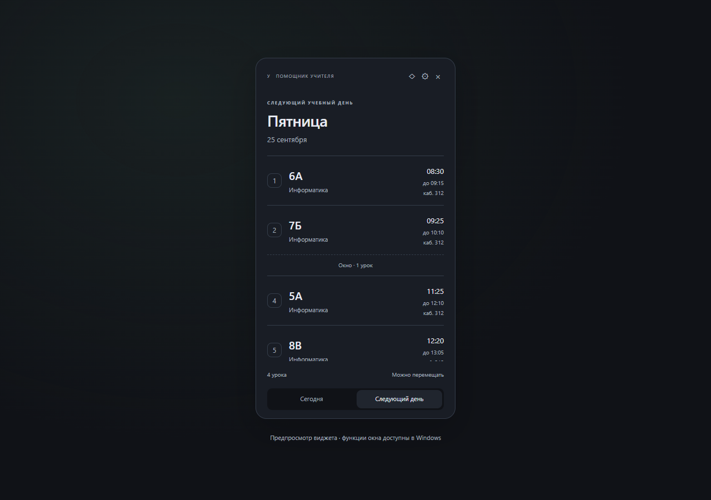

<div align="center">


**Небольшой помощник для больших школьных дней.**

Расписание ближайшего учебного дня прямо на рабочем столе.

[](https://github.com/kuzmin-lemmi/Teacher_Companion/actions/workflows/check.yml)


[Возможности](#возможности) · [Быстрый старт](#быстрый-старт) · [Документация](#документация) · [План развития](docs/ROADMAP.md)

</div>

## Для чего это

Включили компьютер — увидели, какие классы завтра, во сколько начинается первый урок и где есть окно. Не нужно искать фотографию расписания или открывать журнал.

**Teacher Companion / «Помощник учителя»** работает с вашей обычной учебной неделей. Если завтра занятий нет, виджет покажет ближайший день с уроками. Суббота и воскресенье — выходные.

## Интерфейс

<div align="center">



_На снимках — демонстрационное расписание, не реальные данные учителя._

</div>

<details>
<summary><strong>Первый запуск и настройки</strong></summary>


</details>

## Возможности

| Каждый день                              | Под ваш рабочий стол             | Ваши данные                   |
| ---------------------------------------- | -------------------------------- | ----------------------------- |
| Сегодня и следующий учебный день         | Компактный и обычный виджет      | SQLite в Windows              |
| Номера, классы, время, предмет и кабинет | Светлая, тёмная и системная темы | Редакторы уроков и звонков    |
| Окна между занятиями                     | Прозрачность фона 80–100%        | Индивидуальное время урока    |
| Смена даты после полуночи                | Закрепление и режим поверх окон  | Проверка пересечений занятий  |
| Обновление при возвращении к приложению  | Трей и автозапуск Windows        | Экспорт и восстановление JSON |

Первый запуск проведёт через звонки, расписание и внешний вид. Можно пропустить заполнение и вернуться к нему позже. Данные сохраняются явно; при уходе из редактора с изменениями приложение спросит, нужно ли остаться.

## Текущий статус

**Этапы 1–6 реализованы в исходном коде.** Интерфейс, бизнес-логика и сохранение проверяются автоматическими тестами; мастер и основные экраны также проверены в браузере.

**Нативная проверка Windows ещё впереди:** Rust и C++ Build Tools на рабочем компьютере не устанавливались по решению владельца. Трей, прозрачное окно, автозапуск, несколько мониторов и запуск `.exe` требуют проверки в собранном приложении. Тесты адаптера Tauri используют подменённые вызовы и не заменяют эту проверку.

Формат поставки — **`.exe` без установщика**. Готовый бинарный релиз пока не опубликован. Автоматический CI запускает только тесты, проверку форматирования и сборку интерфейса; Windows-сборка вынесена в [отдельный ручной workflow](.github/workflows/windows.yml).

## Быстрый старт

Для работы с интерфейсом достаточно **Node.js 24 LTS** и npm. Rust не требуется.

```bash
git clone https://github.com/kuzmin-lemmi/Teacher_Companion.git
cd Teacher_Companion
npm ci
npm run dev
```

Откройте [localhost:1420](http://127.0.0.1:1420). Пройдите мастер настройки, добавьте свои уроки или восстановите [демонстрационную копию](docs/examples/demo-backup.json) в разделе «Резервные копии».

> Предпросмотр хранит данные в localStorage браузера. Windows-приложение использует отдельную SQLite. Перенос между ними — через резервную копию. Трей, перемещение окна и автозапуск в браузере не действуют.

### Команды

| Команда                              | Результат                                              |
| ------------------------------------ | ------------------------------------------------------ |
| `npm run dev`                        | Предпросмотр с обновлением при изменениях              |
| `npm test`                           | Тесты логики, хранилища, интерфейса и адаптера Windows |
| `npm run build`                      | Проверка TypeScript и сборка интерфейса                |
| `npm run format:check`               | Проверка оформления исходников                         |
| `npm run format`                     | Форматирование исходников                              |
| `npm run tauri dev`                  | Нативный запуск, когда готова среда Rust/MSVC          |
| `npm run tauri build -- --no-bundle` | Сборка `.exe` без установщика                          |

### Будущая сборка Windows

Среда сборки: Rust stable MSVC, C++ Build Tools с Windows SDK и WebView2. Устанавливать их сейчас не требуется. При необходимости ручной workflow **Windows portable build (manual)** соберёт файл на GitHub Actions и сохранит его как артефакт, без публикации релиза.

Результат локальной сборки: `src-tauri/target/release/teacher-companion.exe`. На компьютере учителя нужен WebView2 Runtime, но не Rust. Для автозапуска `.exe` должен оставаться в постоянной папке. Данные хранятся отдельно от `.exe`, в каталоге конфигурации приложения.

## Как устроено

```text
React / TypeScript
  ├── Виджет и календарная логика
  ├── Редакторы, настройки, первый запуск
  └── Резервные копии и проверка данных
           │
           ├── Браузер: localStorage (предпросмотр)
           └── Tauri 2: SQLite + Windows API
                         ├── Трей и единственный экземпляр
                         ├── Окно, позиция, закрепление
                         └── Автозапуск и выбор файлов
```

Данные сохраняются одной атомарной записью: уроки, звонки и настройки не могут обновиться наполовину. Проверка резервной копии выполняется до замены данных. Автозапуск при импорте сохраняет локальное значение и не включается из чужого файла.

## Документация

- [PRD и согласованные решения](PRD.md)
- [Архитектура и хранение данных](docs/ARCHITECTURE.md)
- [План развития](docs/ROADMAP.md)
- [Проверка Windows перед выпуском](docs/WINDOWS-CHECKLIST.md)
- [Как работать с проектом](CONTRIBUTING.md)
- [История изменений](CHANGELOG.md)

Нет регистрации, облачной синхронизации, телеметрии и отправки расписания на сервер. Во время разработки npm загружает зависимости; обычная работа приложения задумана полностью офлайн.
