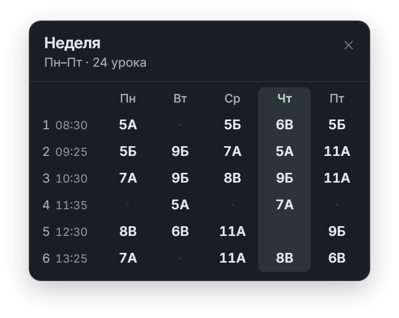
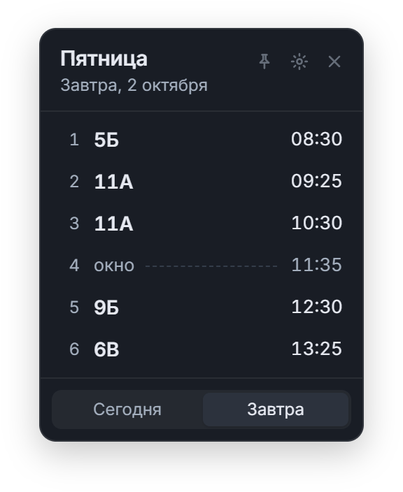

# Помощник учителя — инструкция

Небольшая программа для Windows: расписание ближайшего учебного дня всегда на рабочем столе. Без регистрации и интернета — данные хранятся только на вашем компьютере.

_На снимках — демонстрационное расписание._

- [Установка](#установка)
- [Первый запуск](#первый-запуск)
- [Звонки и расписание](#звонки-и-расписание)
- [Виджет](#виджет)
- [Настройки](#настройки)
- [Значок в трее](#значок-в-трее)
- [Резервные копии и перенос на другой компьютер](#резервные-копии-и-перенос-на-другой-компьютер)
- [Обновление и удаление](#обновление-и-удаление)
- [Частые вопросы](#частые-вопросы)

## Установка

Нужен компьютер с Windows 10 или 11 (64-бит). Права администратора не нужны.

1. Скачайте установщик **[TeacherCompanion-Setup.exe](https://github.com/kuzmin-lemmi/Teacher_Companion/releases/latest/download/TeacherCompanion-Setup.exe)** — или откройте [страницу последней версии](https://github.com/kuzmin-lemmi/Teacher_Companion/releases/latest) и выберите его в разделе **Assets**.
2. Запустите скачанный файл. Если появится синее окно **«Система Windows защитила ваш компьютер»**, нажмите **«Подробнее» → «Выполнить в любом случае»**. Предупреждение появляется потому, что у программы нет платного сертификата подписи; это не вирус.
3. Установщик всё сделает сам: поставит программу в вашу папку пользователя, добавит ярлык **«Teacher Companion»** в меню «Пуск» и запустит её.

Если на компьютере нет компонента Microsoft WebView2 (обычно он уже есть в Windows 10 и 11), установщик скачает его — для этого один раз нужен интернет.

**Без установки.** Файл `TeacherCompanion-Portable.exe` на той же странице запускается сразу. Держите его в постоянной папке (например, в «Документах»), а не в «Загрузках» — иначе автозапуск перестанет работать после переноса файла.

## Первый запуск

Мастер проведёт через четыре шага: **звонки → расписание → внешний вид → готово**. На каждом шаге сохраните изменения (кнопка **«Сохранить изменения»** или **«Сохранить настройки»**), потом нажмите **«Продолжить»**. Любой шаг можно пропустить и заполнить позже в настройках.

После мастера в правом верхнем углу экрана появится виджет.

## Звонки и расписание

Откройте настройки — кнопка ⚙ на виджете — раздел **«Расписание и звонки»**.

**Звонки** (слева, пункт «Звонки»). Нажмите **«+ Добавить звонок»** и укажите номер урока, начало и окончание. Звонки задаются один раз для всех дней и должны идти по порядку, не пересекаясь.

**Уроки** (пункт «Расписание»):

1. Выберите день недели вверху.
2. Нажмите **«+ Добавить урок»**, укажите номер урока и **класс** (обязательно). Предмет и кабинет — по желанию.
3. Время подставится из звонков. Если у урока своё время, отметьте **«Индивидуальное время»**.
4. Нажмите **«Сохранить изменения»** внизу.

**Окно (свободный урок).** Просто не добавляйте урок с этим номером. Например, если есть 4-й и 6-й уроки, 5-й покажется в виджете как «окно» со временем звонка. Если урок уже добавлен — удалите его крестиком ×.

Если сохранить не получается, внизу появится красный блок **«Перед сохранением»** — в нём написано, что исправить (например, не указан класс или звонки пересекаются).

Суббота и воскресенье считаются выходными.

## Виджет

- **Сверху** — день недели и дата. Виджет сам выбирает день: в учебный день — **сегодня**, пока не закончился последний урок, потом — ближайший учебный день: «Завтра» или, например, «Понедельник» в пятницу. Если звонки не заполнены, виджет не знает, когда кончается день, и сразу показывает следующий.
- **Строки** — номер урока, класс, предмет и время. Окно показано пунктиром со временем звонка.
- **Внизу слева** — кабинет и предмет, если у всех уроков дня они одинаковые (чтобы не повторять в каждой строке).
- **Переключатель внизу** — «Сегодня» или следующий день. Ручной выбор действует до конца суток, на следующий день виджет снова выбирает сам. В режиме «Сегодня» текущий урок выделен цветом, прошедшие — бледнее.

Кнопки в правом верхнем углу виджета:

| Кнопка | Что делает                                                                      |
| ------ | ------------------------------------------------------------------------------- |
| 📅     | Показать расписание на всю неделю (Пн–Пт). Закрыть — крестиком или клавишей Esc |
| 📌     | Закрепить виджет, чтобы случайно не сдвинуть. Ещё раз — открепить               |
| ⚙      | Открыть настройки и редактор расписания                                         |
| ×      | Скрыть виджет в трей (программа продолжает работать)                            |

**Переместить виджет** — потяните за верхнюю часть с названием дня. Он запомнит новое место. Закреплённый виджет не двигается.

Окно подстраивается под расписание: весь день виден сразу, без прокрутки.

**Компактный размер** показывает только класс и начало урока — для небольших экранов.

## Настройки

Раздел **«Внешний вид и окно»**:

| Настройка                  | Что меняет                                                      |
| -------------------------- | --------------------------------------------------------------- |
| Тема                       | Тёмная, светлая или как в Windows                               |
| Размер виджета             | Обычный (время, предмет, кабинет) или компактный                |
| Положение на экране        | Угол: справа или слева, сверху или снизу                        |
| Непрозрачность фона        | 80–100 %: при меньшем значении сквозь виджет виден рабочий стол |
| Поверх других окон         | Виджет не прячется за окнами браузера и документов              |
| Закрепить виджет           | То же, что кнопка 📌                                            |
| При закрытии окна          | Скрывать в трей или полностью закрывать программу               |
| Вернуть виджет в угол      | Если виджет перетащили — вернуть в выбранный угол               |
| Запускать вместе с Windows | Виджет появится сам после включения компьютера                  |

Не забудьте нажать **«Сохранить настройки»**.

## Значок в трее

Пока программа работает, её значок есть в области уведомлений рядом с часами (если его не видно — нажмите стрелку **^**).

- **Щелчок левой кнопкой** — показать виджет.
- **Правая кнопка** — меню: «Открыть», «Сегодня», «Следующий учебный день», «Настройки», «Завершить приложение».

Чтобы полностью закрыть программу, выберите **«Завершить приложение»**.

## Резервные копии и перенос на другой компьютер

Раздел **«Резервные копии»** в настройках:

- **«Экспортировать копию»** — сохранить уроки, звонки и настройки в один файл `.json`. Сделайте так после заполнения расписания.
- **«Выбрать файл для восстановления»** → проверьте, сколько уроков в копии → **«Восстановить эту копию»**. Текущее расписание заменится копией.

Чтобы перенести расписание на другой компьютер: экспортируйте копию, скопируйте файл (флешка, почта), установите программу на новом компьютере и восстановите копию.

Попробовать программу без заполнения можно на [демонстрационной копии](examples/demo-backup.json): скачайте файл и восстановите его.

## Обновление и удаление

**Обновление.** Скачайте новый [TeacherCompanion-Setup.exe](https://github.com/kuzmin-lemmi/Teacher_Companion/releases/latest/download/TeacherCompanion-Setup.exe) и запустите — он заменит старую версию. Расписание и настройки сохранятся.

**Удаление.** «Параметры» → «Приложения» → «Установленные приложения» → **Teacher Companion** → «Удалить». Если отметить **«Удалить данные приложения»**, удалится и расписание; без этой отметки оно останется и вернётся при повторной установке.

## Частые вопросы

**Виджет пропал.** Скорее всего, он скрыт в трей — щёлкните значок программы рядом с часами. Если программа была закрыта, запустите её из меню «Пуск».

**Виджет не в том месте.** Настройки → «Внешний вид и окно» → «Вернуть виджет в угол». Если он закреплён, сначала открепите кнопкой 📌.

**Не сохраняется расписание.** Прочитайте красный блок «Перед сохранением» под редактором. Чаще всего не указан класс у одного из уроков. Для свободного урока класс указывать не нужно — удалите этот урок, и он станет окном.

**Нужен ли интернет?** Нет. Программа ничего не отправляет в сеть; интернет нужен только чтобы скачать установщик.

**Где хранятся данные?** В папке `%APPDATA%\ru.teacher-companion.desktop` на этом компьютере. Надёжнее всего периодически делать резервную копию.

**У меня уроки в субботу / чередование недель.** Пока не поддерживается — это в [планах развития](ROADMAP.md).

**Нашли ошибку или есть идея?** Напишите в [Issues](https://github.com/kuzmin-lemmi/Teacher_Companion/issues).
